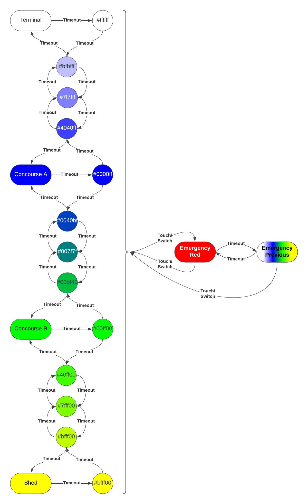
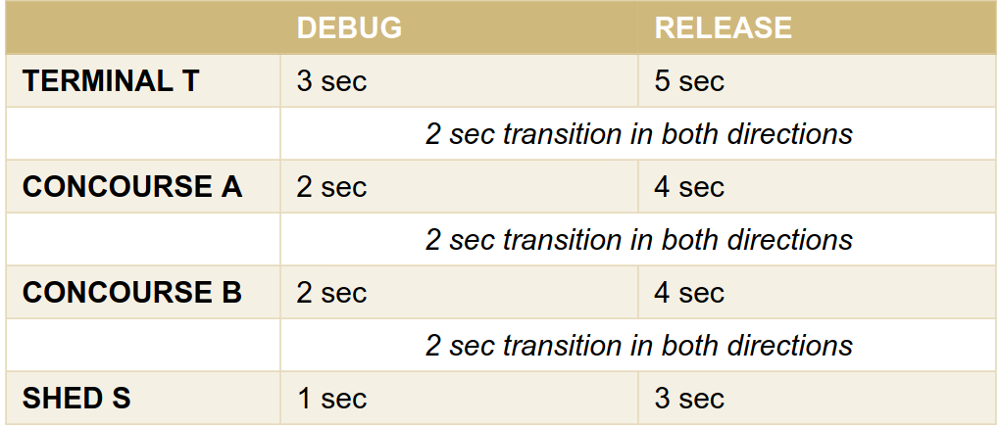
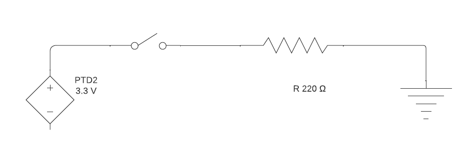

# PES Assignment 4: DIA Trains

## Summary

This state machine manages a simulation of a train moving between stations (LED colors)
- Terminal
- Concourse A
- Concourse B
- Shed

Between each station, the train represents its progress via intermediate states that are fractional color
representations of the train stations between which the train is traveling.

For example, while traveling between Concourse B (green) and the Shed (yellow), the intervening LED colors are 
- 0-500ms: 0x00FF00 B(Departing)
- 500-1000ms: 0x40FF00 B(75%):S(25%)
- 1000-1500ms: 0x7FFF00 B(50%):S(50%)
- 1500-2000ms: 0xBFFF00 B(25%):S(75%)
- Arrive at S...

At stations T and S, the train turns around and the direction of travel is recorded as it leaves the station.

### State Diagram



### Timing



In DEBUG mode, a full cycle should take 24s.

In RELEASE mode, a full cycle should take 36s.

## Implementation Details

### PWM LED Control

LED control is implemented in the `led.h` module, which exposes an API for controlling LEDs based on 
RGB duty-cycle values ranging `[0, 255]`. 

`led_init` initializes the LED PWM system.

`led_control` sets RGB values from three separate values.

`led_control_hex` wraps `led_control` with a single 3-byte hex value that is split into separate bytes and passed to `led_control`. 

The following two calls are equivalent:
```
led_control(0, 127, 255);
led_control_hex(0x007FFF);
```

### SysTick-Based Timing

Timing is implemented via SysTick interrupts that occur approximately every 1/16 seconds. When 
the SysTick interrupt is triggered, the IRQ handler (ISR) increments an internal timekeeping variable. 
Internal time is stored in a `uint32_t` so with ticks of size 1/16s, the internal time counter 
will wrap to zero approximately every 3106 days.

A timing API is provided via the `timing.h` module. Example usage is as follows:

```
uint32_t duration_ticks = 1000;  // 1000 ticks, or ~62.5s
reset_global_timer();  // Set global timer to zero (it counts up)
while(get_global_timer() <  duration_ticks)  // Wait for timer to elapse
{
    // Important work
}
```

This module also provides a convenience "hard-spin" `delay(uint32_t ticks)` function which simply 
blocks until the duration has elapsed.

#### SysTick TSI Triggers

The Systick ISR is also responsible for starting periodic TSI scans. This could be further improved by using a different interrupt such as PIT to decrease the coupling between modules but this system works well and the PIT
module was not part of the scope of this project.

### Touch Interrupts

The `tsi.h` module provides the API for configuring the TSI peripheral as well as a function to start a scan. 

The peripheral is configured to interrupt when a TSI scan finishes with a touch value that is out of the bounds 
of the configured TSI threshold (e.g. [0, 300]). If the bounds are violated, a touch event has occurred and a global 
indicator variable is set.

NOTE: Remember to clear the `touch_indicator` variable after responding to it. 

NOTE: When a TSI scan results in a value that is _not_ a violation of the threshold bounds, the EOSF flag is never
reset. Clearing the EOSF flag is therefore the responsibility of the TSI ISR function, which checks only that there is no 
scan currently in progress before starting a new one.


### Switch Interrupts

The `switch.h` module provides the API for configuring a switch to interrupt operations in exactly the same manner 
as the TSI. For the switch, the trigger event is any change in switch state. i.e. a push is simply a "change", as is 
a release.

NOTE: The TSI and the Switch can interfere with eachother. If the train is in emergency mode (e.g. due to a touch 
event) and the switch is closed, it will take the train out of emergency mode. Subsequently opening 
the switch will put the train back into emergency mode. A final TSI touch can be used to bring the system back to 
nominal operation with the switch remaining open.

#### Switch Wiring Diagram



