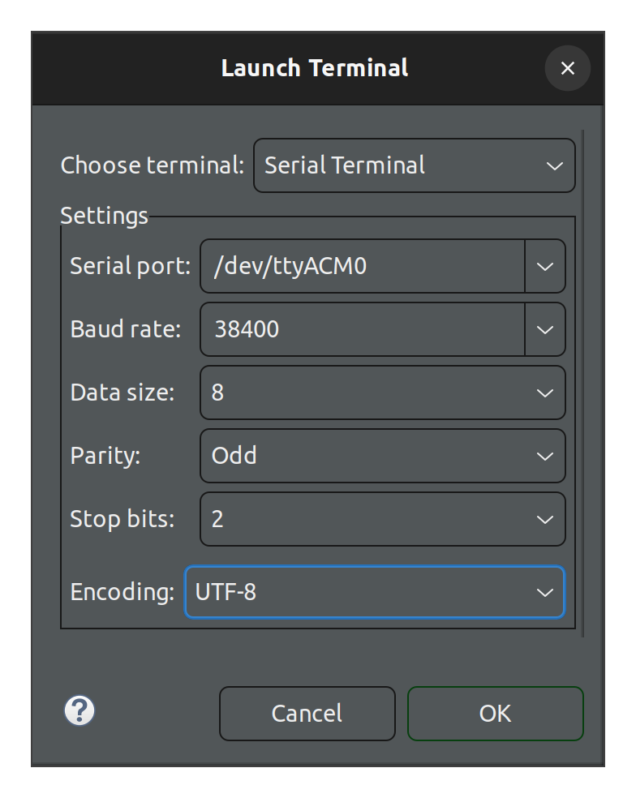
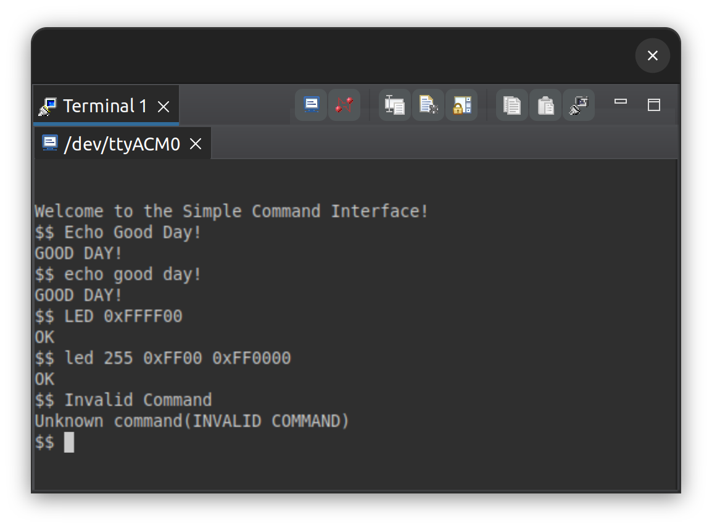

# PES Assignment 6: SerialIO

## Configuration

To configure your serial console to interact with the Simple Command Interface (SCI)
set the following parameters:

- Baud rate: 38400
- Parity: enabled
- Parity: odd
- Stop bits: 2



## Usage




The Simple Command Interface is case insensitive and supports exactly 
two commands: `echo` and `led`. 

### ECHO

The `echo` command can be run with or without arguments
(in the absense of arguments it simply prints a new line). 

```
$$ echo the bar is foo
THE BAR IS FOO
$$ echo

$$ 
```

### LED

The `led` command requires at least one argument 
to be valid; arguments can be literal integers in decimal 
or hex format. e.g. `0xFF00FF` or `147`. 
Values passed to `led` must be strictly less than `0xFFFFFF`.

```
$$ led 255
OK
$$ led 255 0xff00 0 0xffffff
OK
$$ led
Unknown Command (LED)
$$ led 0xffffffff
Unknown Command (LED 0XFFFFFFFF)
$$
```


