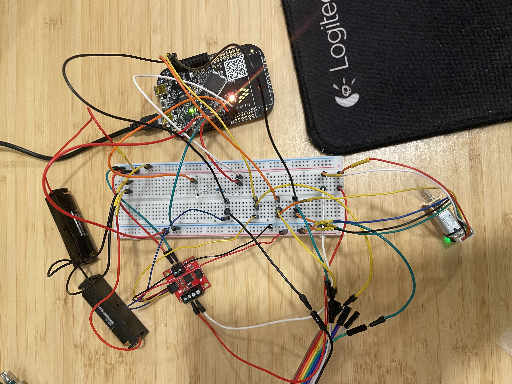

# SCILS - Scanning Commandable Instrument with Light Sensing

Welcome to the SCILS readme page!

This is the control software for a commandable instrument that can point a motor to specific locations.
This instrument is sensitive to light! If light is detected on the phototransistor, the whole system 
goes into SAFE mode. In safe mode, the motor points to index 0 and motor control commands are no longer accepted. 

## Available Commands

NOTE: The command prompt was implementd on a tight schedule! If things look poorly formatted, press enter to refresh the prompt.

### MTRSET
The MTRSET command sets the motor to a specific set point. e.g. `MTRSET 1000`.

### RESUME
The RESUME command brings the instrument back out of SAFE mode.

### LED
The LED command sets the LED color on the board. You probably don't want to do this though because the LED functions as a status indicator on the board.

### ECHO
The ECHO command simply echoes back the arguments. e.g. `ECHO THE SKY is blue` will return `THE SKY IS BLUE`.
This is pretty useless.

## Status Indicator LED

GREEN = motor successfully pointed to within tolerance

WHITE = motor currently moving to set point

BLUE = motor failed to point to set point within tolerance and timed itself out

RED = danger (light) detected! going to safe mode and moving motor to safe mode position (0).

YELLOW = SAFE (and sound)

## Functional Elements

### Motor Driver

The Sparkfun QWIIC serial controlled motor driver (SCMD) operates in I2C mode for this project. It is initially configured but to control drive speed, only a single register is written (many times). Power to the motor driver is provided with 2x AA batteries (though I recommend finding a few more volts -- up to 12 -- to make things work better).

### Phototransistor

The PT is hooked up to the differential ADC0 pins (they don't have headers so it's annoying). There is a constant threshold set in the code that watches for a change in voltage over the PT and triggers a SAFE mode event if the threshold is breached.

### SysTick

This is almost incidental. A few included modules utilize a delay function based on systick but it's not core to the system function. The SysTick counts every 1/16th of a second.

### Timers

The whole state machine is controlled asynchronously of the UART command prompt using a TPM interrupt that watches for changes to the instrument state (e.g. safe modes or motor set points). A single TPM (TPM1) times both the PT and the SAFE mode triggers but they are checked on different cadences but implementing a software-level modulus for each event that overflows to trigger each check.

The TPM itself is configured to overflow at 1kHz (counter counts at 375kHz and the modulus is set to 375). 
Each of the PT and SAFE event triggers has its own software level modulus that is counted. These two are separately configurable but the are currently set to 100ms.

### UART Interface

The command prompt is provided with a custom UART driver and command processor.

